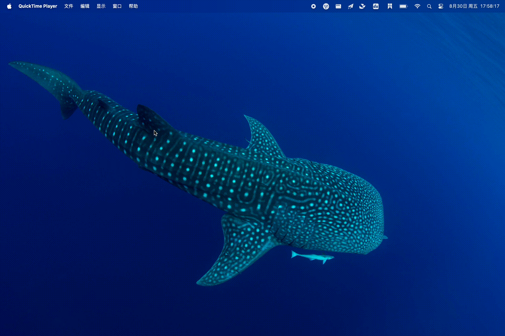

# wallpaper-switch
👊 Macos wallpaper switch alfred flow 👊

## Usage
1. Very simple, input `cim` will be ok.
    
2. Enter to select the wallpaper.
    

## History version
If you want use v1 version, you can find it from https://github.com/o98k-ok/cim-flow

Compare to v1 version, this version has more features:
1. support `GridView` to select history images.
2. v2 code is easy to understand.

## Thanks
That's all, enjoy it!